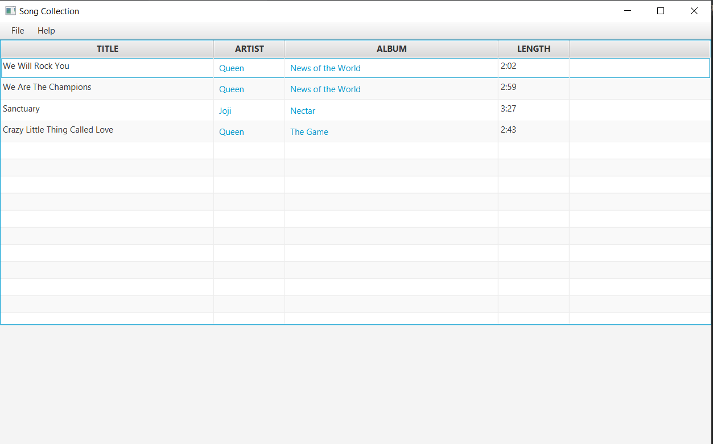
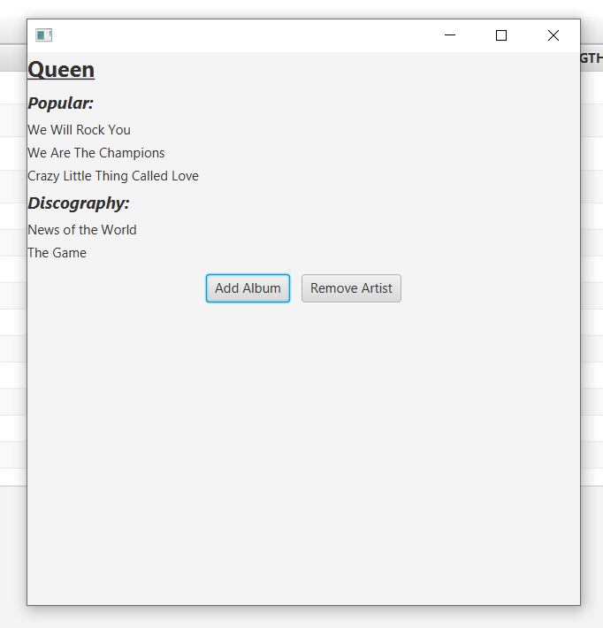
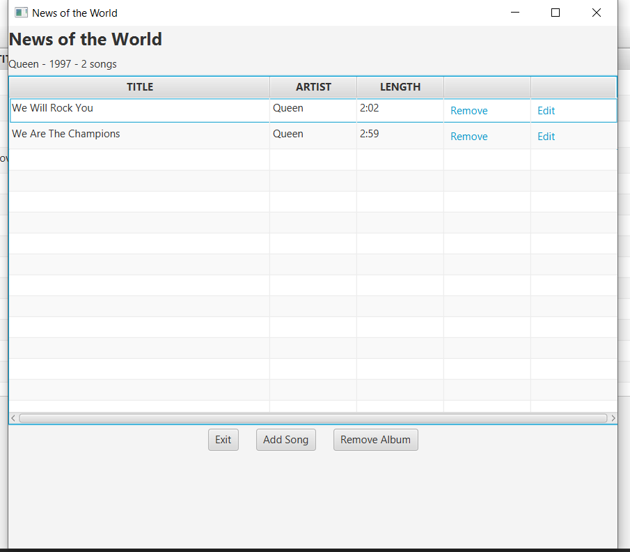

# CS4015Project

## <ins> Overview

### <ins> Introduction

In this project, we took an existing project created by Colton Coughlin for course CS3035 - User Interfaces as an individual project. 
We decided to take the project and refactor it to implement the design patterns we learned in this course.

### <ins> Language
This project is built in JavaFx/Java. The only thing to note is that instead of simple objects like String, List<>, etc.,
you will see variables such as SimpleStringProperty and SimpleObjectProperty. These types of variables
allow the values to be Observable, so when a change happens the tables of the app will know.

### <ins> Architecture
The original project was built with Model-View-Controller architecture but the refactored version is not as concerned with
architecture. This project is focused on design patterns.

## <ins> The Original Concept

The original project was a song information application. This application was built to replicate the popular music application Spotify 
but without playback features.  The application consisted of 3 domain objects that have relationships with each other:
- Artist
- Album
- Song

#### <ins> Main View

As you can see in the image above, there is a table of songs. Like Spotify, you can click on the song's album name and
artist name to get more information.

#### <ins> Artist View

#### <ins> Album View

Along with viewing information, the client can also add,remove,and edit the 3 domain objects. Do note that only the editing of
songs is implemented.

## <ins> Views

This project consists of multiple windows. Some of them allow contextual information to be automatically entered in
forms. For example, if you add a song to an album, the album's title and the song's publish date are prefilled since the album 
has that information already. Most windows in the application are forms for filling information on an object for creation
and modification. All window classes are indicated in source code by the name format: 'something'View.

## <ins> Refactor and Added Features

### <ins> Refactoring

After refactoring, this project now implements various design patterns including:

- [Singleton Pattern](https://github.com/NiftyAlpaca/CS4015Project/blob/main/doc/Singleton.md)
- [Proxy Pattern](https://github.com/NiftyAlpaca/CS4015Project/blob/main/doc/Proxy.md)
- Facade Pattern
- [Command Pattern](https://github.com/NiftyAlpaca/CS4015Project/blob/main/doc/Command.md)
- Iterator Pattern

### <ins> Added Features

While implementing design patterns, we have added multiple features to the original project:

- Playback is now available. Although no actual audio is played, we have recreated the scenario of playing music with text.
To perform playback, do File -> Play. Information about how the feature is implemented, refer to Iterator.md in the document
folder of the project.
- The client can now undo any action by doing Edit -> Undo.
