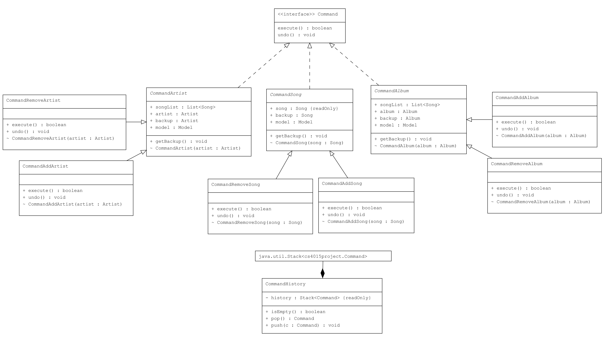

## <ins> Command Pattern

We used the command pattern to implement that ability to "undo" certain actions the user can perform within the application.
When a user modifies (add/remove) the artists, songs, or albums, they can navigate to the "Edit" menu item and select "Undo" to undo all actions performed in a stack (First in last out).

To implement the Command pattern, we created a new `Command` interface which all subsequent command classes would implement. We then created an abstract class per each item we could perform actions on:
- `CommandArtist`
- `CommandSong`
- `CommandAlbum`

Each abstract class has two children, `CommandAddX`/`CommandRemoveX` to log and handle the respective actions.

An additional class is created to store the current commands that can be undone called `CommandHistory`.
This class features a stack of the commands that have been executed.

Below is an example code snippet to create the ability to "undo" action of adding an artist:

```java
import cs4015project.Artist;
import cs4015project.HelloApplication;

public interface Command
{
    void undo();

    boolean execute();
}

//abstract class for Artist object related actions
public abstract class CommandArtist implements Command
{
    public Model model = HelloApplication.model; //class containing the functionality we want to be able to undo
    public Artist backup; //to store a backup of the artist object
    public Artist artist; //to retrieve the artist

    CommandArtist(Artist artist)
    {
        this.artist = artist;
    }

    //create the backup artist object
    public void getBackup()
    {
        backup = artist;
    }
}

//Class to reference when adding an artist
public class CommandAddArtist extends CommandArtist
{
    CommandAddArtist(Artist artist)
    {
        super(artist);
    }

    @Override
    public void undo()
    {
        //code to remove the added artist
    }
    
    @Override
    public boolean execute()
    {
        getBackup();
        //code to add the artist
    }
}
```

When the `execute` method is called, the instance of `CommandAddArtist` will be pushed to the `CommandHistory` stack.

UML representation:

