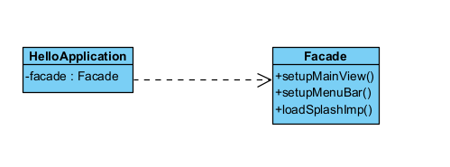

## <ins> Facade Pattern

In this project, we used the Facade pattern to give the client a simpler interface when setting up the main view of the
application. Instead of doing all the work in HelloApplication. We created a Facade class called Facade and put methods
in the class that contains the work. So the client only needs to do call the facade methods. If the way things are setup later,
we just update the Facade class and don't need to change the client:

```
    public class Facade(){
        setupMainTable(){
            //do stuff
        }
        setupMenuBar(){
            //do stuff
        }
        loadSplashImp(){
            //do stuff
        }
        loadSplash(){
            //do stuff
        }
    }
    
    public class HelloApplication(){
        Facade facade = new Facade();
        facade.setupMainTable();
        facade.setupMenuBar();
        facade.loadSplashImp();
    }
```

The UML is as follows:

