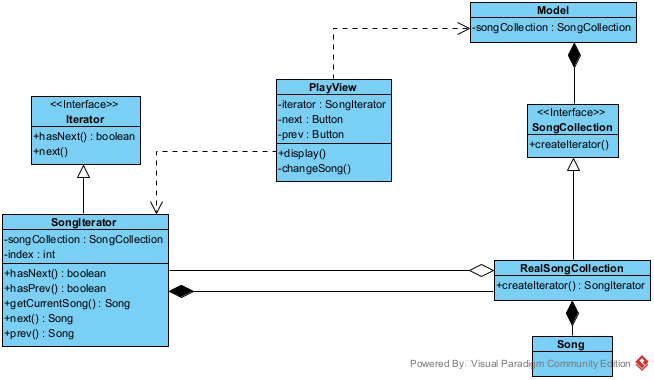

## <ins> Iterator Pattern

We used the iterator pattern to implement the ability to traverse their collection of songs by simulating playback by giving the user the option to go to the next/previous song in the playlist. This allows for the decoupling of classes and the collection and allows for future features that iterate over the collection to do so reliably. This also allows for the data structure respresenting the collection to change if needed without having to change the way many classes traverse the collection.

To implement the Iterator pattern, we created a new user interface with the `PlayView` UI where the user interacts with the system. 

This UI uses the newly implemented `SongCollection` interface as a collection of items (Songs) to traverse. This interface has concrete implementations `ProxySongCollection` and `RealSongCollection` which are used by the system according to the proxy pattern.

`SongCollection` also declares a method `createIterator()` which returns a `SongIterator` object with a reference to the collection starting at position 0. The `SongIterator` class implements the built-in java interface `Iterator` and includes methods to traverse the collection, as well as get the current item.

Below is an example code which shows how the classes interact, and how the user traverses them:

```java

import java.util.Iterator;

public class SongIterator implements Iterator {
    private int index;
    private final SongCollection songCollection;

    public SongIterator(SongCollection songCollection){/*Assigns the collection and index defaults to 0*/}

    public Song getCurrentSong(){ return this.songCollection.getSongByIndex(index); }

    @Override
    public boolean hasNext(){ return index < (songCollection.size() - 1); }
    public boolean hasPrev(){ return index > 0; }

    @Override
    public Song next(){/*if there is a next song, increment index and return it*/}
    public Song prev(){/*if there is a previous song, decrement index and return it*/}
}

public class RealSongCollection implements SongCollection{
    private SimpleListProperty<Song> songCollection;
    public SongIterator createIterator(){ return new SongIterator(this); }
}

public class PlayView {
    //An iterator to traverse a pre-defined playlist(SongCollection)
    private static SongIterator iterator;
    //Buttons for the user to 
    private static final Button next = new Button("Next");
    private static final Button prev = new Button("Prev");

    public static void display(){
        //Dealing with at least one song
        if (Model.getInstance().getSongCollection().size() > 0){
            iterator = Model.getInstance().getSongCollection().createIterator();
            changeSong(iterator.getCurrentSong());
        }
    }

     private static void changeSong(Song song){
        if(iterator.hasNext()){
            //include the next button on the window
        }
         if(iterator.hasPrev()){
            //include the previous button on the window
        }
     }
}

```

Here is the UML representation of this interaction:


