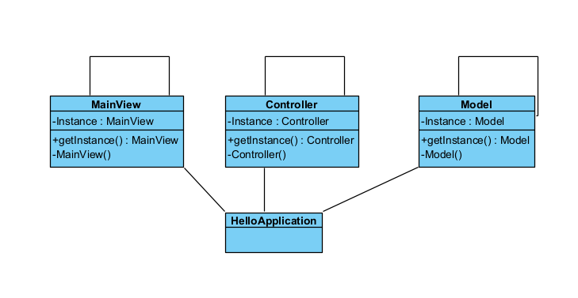

## <ins> Singleton Pattern

Before refactoring, our system had three global variables:

- Model model
- MainView view
- Controller controller

These three were initialized through simple object creation: 

public static final Model model = new Model()

After implementing the Singleton Pattern, the three objects:
Main View, Model, and Controller now can only have a single
instance. The UML of the Singletons is identical to the image below:

These changes improve the code by limiting instances of
objects that interact with global variables. 
